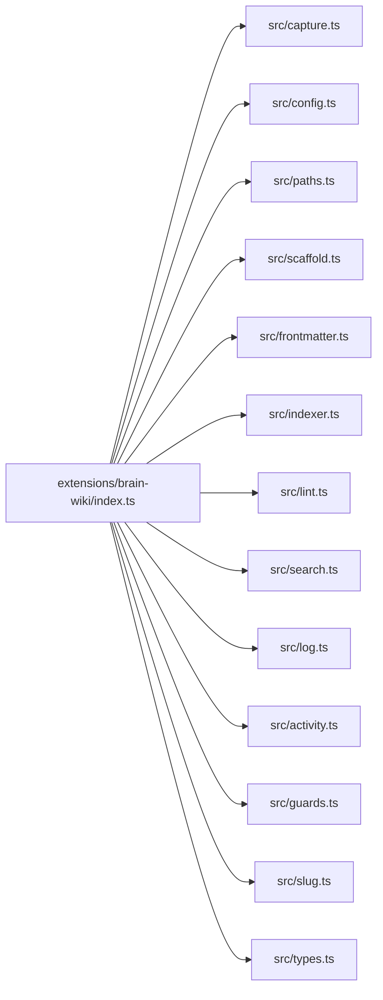

# Module Map

| Module | Entry file |
|--------|-----------|
| Extension entry | extensions/brain-wiki/index.ts |
| capture | extensions/brain-wiki/src/capture.ts |
| config | extensions/brain-wiki/src/config.ts |
| paths | extensions/brain-wiki/src/paths.ts |
| scaffold | extensions/brain-wiki/src/scaffold.ts |
| frontmatter | extensions/brain-wiki/src/frontmatter.ts |
| indexer | extensions/brain-wiki/src/indexer.ts |
| lint | extensions/brain-wiki/src/lint.ts |
| search | extensions/brain-wiki/src/search.ts |
| log | extensions/brain-wiki/src/log.ts |
| activity | extensions/brain-wiki/src/activity.ts |
| guards | extensions/brain-wiki/src/guards.ts |
| slug | extensions/brain-wiki/src/slug.ts |
| types | extensions/brain-wiki/src/types.ts |
