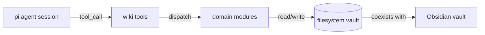

# System Map

## Core layers

```
pi agent session → Extension tool handlers → Domain modules → Filesystem (wiki vault)
```

## Integrations

- pi-coding-agent → tool registration, event hooks (resource discovery, tool_call guard, agent_end rebuild)
- Obsidian vault → wiki pages can live inside an Obsidian vault (Brain/Wiki/) and coexist with PARA folders



## Layers

| Layer | Role |
|-------|------|
| Tool handlers | Expose wiki operations as pi tool calls (capture, search, lint, ensure, bootstrap, status) |
| Domain modules | Business logic: config, paths, scaffold, frontmatter, indexer, lint, log, activity, guards |
| Guard hooks | Block writes to protected paths; trigger metadata rebuild on agent-end |
| Filesystem | Persistent storage: .wiki/config.json, inbox/, pages/, meta/, archive/ |
