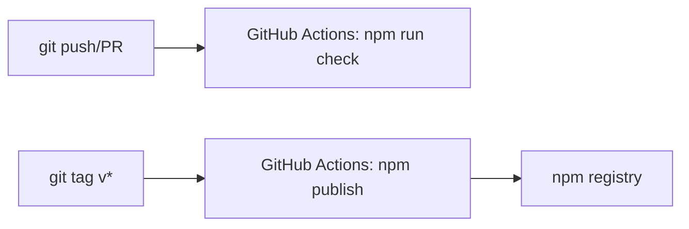

# Deploy Guide

## Build

No build step required. Source TypeScript files are executed directly by pi-coding-agent via `--experimental-strip-types`.

## Release

Automated release script:

```
npm run release:patch
npm run release:minor
npm run release:major
```

Each command:
1. Bumps the version in package.json
2. Updates CHANGELOG.md
3. Creates a git tag
4. Commits the changes

After release, push tags:
```
npm run release:push
```

## CI/CD pipeline



- CI: runs on push and PR to main — executes `npm run check`
- Release: runs on version tags — publishes to npm registry (public access)

## Prerequisites

- npm authentication configured for publishing
- Git remote configured with push access
