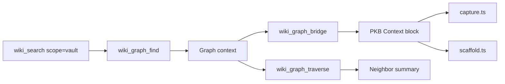

# Graph-First Architecture

## Overview

- Vault discovery moves through Obsidian search, backlinks, and links before falling back to registry-style summaries.
- The feature adds graph tools for finding context, traversing neighborhoods, and bridging wiki pages into PKB nodes.

## Architecture

## Key Files

| File | Role |
|------|------|
| `extensions/brain-wiki/src/graph.ts` | Graph discovery helpers for context search, traversal, bridging, and PKB context rendering |
| `extensions/brain-wiki/index.ts` | Registers `wiki_search` scope handling plus `wiki_graph_find`, `wiki_graph_traverse`, and `wiki_graph_bridge` |
| `extensions/brain-wiki/src/search.ts` | Routes `scope: "vault"` searches through Obsidian CLI search and keeps wiki search registry-backed |
| `extensions/brain-wiki/src/capture.ts` | Seeds captured summary pages with graph context when a client exists |
| `extensions/brain-wiki/src/scaffold.ts` | Seeds ensured canonical pages with graph context when a client exists |
| `extensions/brain-wiki/src/graph.test.ts` | Covers graph discovery, traversal, and bridge formatting |

## Implementation Notes

- Vault searches use Obsidian CLI `search`, `properties`, `backlinks`, and `links`.
- Graph results are split into `wiki` and `pkb` zones.
- `bridgeWikiPage` filters out already-linked candidates before returning suggestions.
- `renderPkbContextBlock` writes the `## PKB Context` section used by capture and scaffold flows.
- Registry-backed wiki search remains available for wiki-only lookups.

## Dependencies

- `obsidian-client` → vault search, backlinks, links, and property reads
- `search` → search scope routing between wiki registry search and vault search
- `capture` → capture-time PKB context seeding
- `scaffold` → page creation-time PKB context seeding
