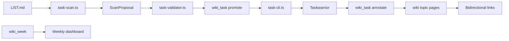

# Taskwarrior Integration

## Overview

Integrates Taskwarrior CLI with the brain-wiki vault for validated task promotion, annotation, completion, weekly dashboard refresh, and bidirectional wiki linking.

---

## Architecture

---

## Key Files

| File | Role |
|------|------|
| `extensions/brain-wiki/src/task-cli.ts` | Wraps Taskwarrior CLI execution, JSON export parsing, and UDA/installation error detection |
| `extensions/brain-wiki/src/task-validator.ts` | Validates promotion payloads against creation rules (TYPE prefix, project format, estimate bounds, required fields) |
| `extensions/brain-wiki/src/task-scan.ts` | Scans LIST.md for stale items and generates promotion proposals |
| `extensions/brain-wiki/src/task-sync.ts` | Bidirectional LIST.md ↔ Taskwarrior sync: marks promoted items, syncs completed tasks back to LIST.md |
| `extensions/brain-wiki/index.ts` | Registers `wiki_task`, `wiki_task_scan`, and `wiki_week` tools; handles promote/annotate/done actions |
| `skills/taskwarrior/SKILL.md` | Agent skill manifest and trigger definitions |
| `skills/taskwarrior/instructions/creation-rules.md` | Task creation conventions, TYPE prefix mapping, split rules, and agent write permissions |
| `skills/taskwarrior/instructions/session-workflow.md` | Session lifecycle, LIST.md draining protocol, and bidirectional linking rules |

---

## Implementation Notes

- Description must start with a valid TYPE prefix: `BUG:`, `FEAT:`, `RD:`, `REVIEW:`, `SETUP:`, `PLAN:`, or `MEETING:`
- Project must be in `Domain.SpecificOutcome` format with a dot separator
- Estimate must be one of `0.5`, `1`, `1.5`, `2`, `2.5`, or `3`; larger work must be split into chained sub-tasks with `depends:`
- All tasks must have `scheduled`, `priority`, `estimate`, and at least one `tag`
- Agent may only `add`, `annotate`, and `done`; never `modify` core fields, `delete`, or un-complete
- No unscheduled tasks are allowed
- LIST.md items older than 7 days are proposed for promotion
- Items marked with `[>]` are skipped during scan (already promoted)
- When promoting, pass `source: LIST.md:YYYY-MM-DD:item-N` to link the task back to LIST.md
- Promoted LIST.md items are marked `[>]` automatically; completed tasks sync back to `[x]`
- `wiki_task_scan` and `wiki_week` run `syncCompletedTasksToList` first to mark done items
- Annotations are append-only and formatted as `YYYY-MM-DD: <event description>`
- Bidirectional links must be maintained between task annotations and wiki topic pages

---

## Dependencies

- `task-cli` → wraps Taskwarrior CLI for all vault-side task operations
- `task-scan` → reads LIST.md and proposes stale items for promotion (skips `[>]` and `[x]`)
- `task-validator` → enforces creation rules before promotion
- `task-sync` → bidirectional sync: marks promoted items `[>]`, syncs completed tasks to `[x]`
- `paths` → resolves LIST.md and vault root
- `obsidian-io` → reads/writes LIST.md through Obsidian CLI when available
- `wiki-week` → renders weekly dashboard and task summaries
