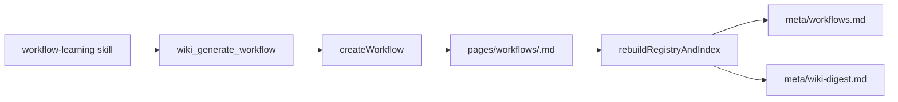

# Workflow Generation

## Overview

Generates standardized workflow pages from structured inputs.
Adds workflows as indexed wiki pages and regenerates `meta/workflows.md` as the short route page agents read before invoking learned behavior.

---

## Architecture

---

## Key Files

| File | Role |
|------|------|
| `extensions/brain-wiki/index.ts` | Registers `wiki_generate_workflow`, logs workflow events, rebuilds route metadata |
| `extensions/brain-wiki/src/workflow.ts` | Creates workflow pages, renders workflow YAML, rebuilds workflow route page |
| `extensions/brain-wiki/src/workflow.test.ts` | Covers generation, conflict detection, and route rendering |
| `extensions/brain-wiki/src/types.ts` | Adds `workflow` page type and workflow request/result contracts |
| `extensions/brain-wiki/src/config.ts` | Adds workflow page directory and template defaults |
| `extensions/brain-wiki/src/scaffold.ts` | Bootstraps workflow template, workflow directory, and empty route page |
| `extensions/brain-wiki/src/indexer.ts` | Includes workflows in registry and generated index |
| `extensions/brain-wiki/src/digest.ts` | Adds workflow count and route pointer to wiki digest |
| `extensions/brain-wiki/src/lint.ts` | Adds required workflow frontmatter and skips source coverage warnings |
| `extensions/brain-wiki/src/paths.ts` | Resolves `[[workflows/...]]` wikilinks and generated workflow route metadata |
| `extensions/brain-wiki/src/search.ts` | Adds Obsidian search scope for workflow pages |

---

## Implementation Notes

- Workflow pages live under `pages/workflows/` and use `type: workflow`.
- `triggers` are mirrored into `aliases` so existing registry search and route matching can reuse page aliases.
- The body contains a fenced `yaml` block to keep the operational workflow spec visible and standard.
- Duplicate protection checks existing workflow titles and trigger aliases before writing a new page.
- `meta/workflows.md` is generated from the registry, not hand-maintained.
- `wiki_generate_workflow` requires user-approved structured input; extraction remains skill-owned.

---

## Dependencies

- `frontmatter` → writes the generated workflow markdown page
- `slug` → normalizes workflow filenames and ids
- `indexer` → discovers workflow pages through configured page types
- `log` → records `workflow` events
- `digest` → exposes the route-page pointer to future agents
