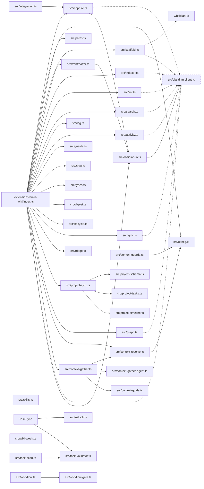

# Module Map

| Module | Entry file | Status |
|--------|-----------|--------|
| Extension entry | extensions/brain-wiki/index.ts | current |
| capture | extensions/brain-wiki/src/capture.ts | current |
| config | extensions/brain-wiki/src/config.ts | current |
| paths | extensions/brain-wiki/src/paths.ts | current |
| scaffold | extensions/brain-wiki/src/scaffold.ts | current |
| frontmatter | extensions/brain-wiki/src/frontmatter.ts | current |
| indexer | extensions/brain-wiki/src/indexer.ts | current |
| lint | extensions/brain-wiki/src/lint.ts | current |
| search | extensions/brain-wiki/src/search.ts | current |
| log | extensions/brain-wiki/src/log.ts | current |
| activity | extensions/brain-wiki/src/activity.ts | current |
| guards | extensions/brain-wiki/src/guards.ts | current |
| slug | extensions/brain-wiki/src/slug.ts | current |
| types | extensions/brain-wiki/src/types.ts | current |
| digest | extensions/brain-wiki/src/digest.ts | current |
| lifecycle | extensions/brain-wiki/src/lifecycle.ts | current |
| sync | extensions/brain-wiki/src/sync.ts | current |
| triage | extensions/brain-wiki/src/triage.ts | current |
| project-sync | extensions/brain-wiki/src/project-sync.ts | current |
| graph | extensions/brain-wiki/src/graph.ts | current |
| context-resolve | extensions/brain-wiki/src/context-resolve.ts | current |
| context-gather | extensions/brain-wiki/src/context-gather.ts | current |
| context-gather-agent | extensions/brain-wiki/src/context-gather-agent.ts | current |
| context-guards | extensions/brain-wiki/src/context-guards.ts | current |
| context-guide | extensions/brain-wiki/src/context-guide.ts | current |
| integration | extensions/brain-wiki/src/integration.ts | current |
| skills | extensions/brain-wiki/src/skills.ts | current |
| project-schema | extensions/brain-wiki/src/project-schema.ts | current |
| project-tasks | extensions/brain-wiki/src/project-tasks.ts | current |
| project-timeline | extensions/brain-wiki/src/project-timeline.ts | current |
| task-cli | extensions/brain-wiki/src/task-cli.ts | current |
| task-scan | extensions/brain-wiki/src/task-scan.ts | current |
| task-validator | extensions/brain-wiki/src/task-validator.ts | current |
| wiki-week | extensions/brain-wiki/src/wiki-week.ts | current |
| workflow | extensions/brain-wiki/src/workflow.ts | current |
| workflow-gate | extensions/brain-wiki/src/workflow-gate.ts | current |
| obsidian-client | extensions/brain-wiki/src/obsidian-client.ts | current |
| obsidian-io | extensions/brain-wiki/src/obsidian-io.ts | current |
