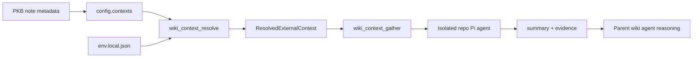

# External Context

## Overview

- Deterministic PKB-linked local repository resolution and bounded read-only gathering for repo-backed reasoning.
- Three-layer model: PKB note metadata → checked-in `contexts` registry → untracked `.wiki/env.local.json` path mapping.
- Explicit activation only — tools do not auto-explore repos when a note is merely mentioned.

## Architecture

## Key Files

| File | Role |
|------|------|
| `extensions/brain-wiki/src/context-resolve.ts` | Resolve `context_id` or `pkb_note` to validated local repo descriptor |
| `extensions/brain-wiki/src/context-gather.ts` | Intent-specific gather orchestration; repo agent first, recipe fallback |
| `extensions/brain-wiki/src/context-gather-agent.ts` | Spawns isolated Pi agent in resolved repo cwd |
| `extensions/brain-wiki/src/context-guards.ts` | Blocks parent-session direct access to configured external repos |
| `extensions/brain-wiki/src/config.ts` | `contexts` registry normalization and `loadLocalEnvConfig` |
| `extensions/brain-wiki/src/types.ts` | External context config, resolve/gather I/O, and evidence types |
| `extensions/brain-wiki/index.ts` | Registers `wiki_context_resolve` and `wiki_context_gather` |
| `.wiki/env.local.example.json` | Checked-in template for per-machine repo-key mappings |
| `docs/superpowers/specs/2026-06-21-external-context-design.md` | Design spec, activation model, and tool contract |

## Implementation Notes

- Context registry lives in `.wiki/config.json` under `contexts` (not a separate file).
- PKB notes may declare `brain_wiki_context: <context-id>` as a stable pointer into the registry.
- Registry entries use `repo_key`; absolute paths stay in untracked `.wiki/env.local.json`.
- `wiki_context_resolve` performs no repo exploration — only config merge and path validation.
- `wiki_context_gather` spawns an isolated Pi agent in the resolved repo cwd (follows target `AGENTS.md` and repo skills), with bounded recipe fallback when the agent fails.
- Parent wiki sessions cannot `read`/`grep`/`find`/`ls`/`bash` configured external repo paths directly — use gather instead.
- Supported intents: `overview`, `architecture`, `implementation`, `recent_changes`, `question`, `handoff`.
- `implementation` and `question` require a concrete `query`.
- Gather bounds: 3 seed files, 5 search results, 5 commits (defaults in gather module).
- Fail closed on missing registry entries, missing env mappings, non-absolute paths, or disallowed intents.

## Dependencies

- `config` → `contexts` registry and local env loading
- `context-resolve` → descriptor validation before gather
- `context-gather` → bounded repo inspection via injected file/exec helpers
- `scaffold` → writes `env.local.example.json` during vault bootstrap
