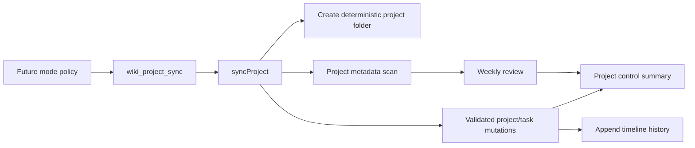

# Future Mode Project Review

## Overview

Adds deterministic, retrieval-first `Project/` handling to `wiki_project_sync`.
Project scan now treats `project.md` as canonical, review understands the full status model, and mutation commands keep `Project/` in sync with structured task queues and append-only timeline history.

---

## Architecture

---

## Key Files

| File | Role |
|------|------|
| `extensions/brain-wiki/index.ts` | Registers the expanded `wiki_project_sync` action surface and formats scan/review/mutation output |
| `extensions/brain-wiki/src/project-sync.ts` | Scans project metadata, writes deterministic project folders, mutates state, manages task promotion, computes review gaps |
| `extensions/brain-wiki/src/project-schema.ts` | Defines canonical project template and frontmatter validation rules |
| `extensions/brain-wiki/src/project-tasks.ts` | Parses structured task queues, allocates task ids, updates task blocks |
| `extensions/brain-wiki/src/project-timeline.ts` | Formats append-only timeline entries |
| `extensions/brain-wiki/src/project-sync.test.ts` | Covers canonical `project.md` scan, status review, project mutations, task mutations, task promotion, and frontmatter normalization |
| `extensions/brain-wiki/src/types.ts` | Adds expanded project action/result and review contracts |
| `docs/ideas/future-mode.md` | Source policy for retrieval-first PARA project maintenance |

---

## Implementation Notes

- `create_project` now writes `Project/wNN-Title/project.md`, `tasks.md`, `timeline.md`, and `notes.md`.
- Created projects seed canonical frontmatter: `type`, `title`, `status`, `created`, `updated`, `area`, `priority`, `deadline`, `next_action`, `review_after`, `resources`, `related_projects`, `tags`.
- Project scan reads `project.md` first, then legacy same-named project files and fallback files: `index.md`, `PROJECT.md`, `README.md`.
- `set_status`, `set_next_action`, `set_deadline`, `link_resource`, `relate`, and `timeline_append` mutate `project.md` / `timeline.md` through validated command paths.
- `task_add`, `task_update`, `task_block`, `task_close`, and `task_promote` operate on structured task blocks in `tasks.md`.
- `next_action` is preferred; `last_action` remains a backward-compatible fallback for scan/review.
- `review` is read-only: reports counts for the canonical status set, missing next actions, blocked projects, stale active projects, and done projects that can be archived.
- `Project/PROJECTS.md` is skipped during project scan so the control panel is not treated as a project.
- frontmatter normalization preserves Obsidian wikilinks as scalar or flat list values after project mutations

---

## Dependencies

- `obsidian-io` → reads/writes vault-visible project markdown through Obsidian CLI when available
- `paths` → resolves `Project/` and `LIST.md` from the wiki root
- `types` → exposes the extended project sync action/result contract
- `gray-matter` → parses and reserializes canonical project frontmatter
